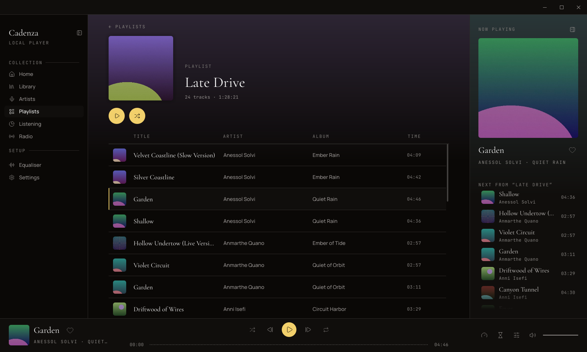
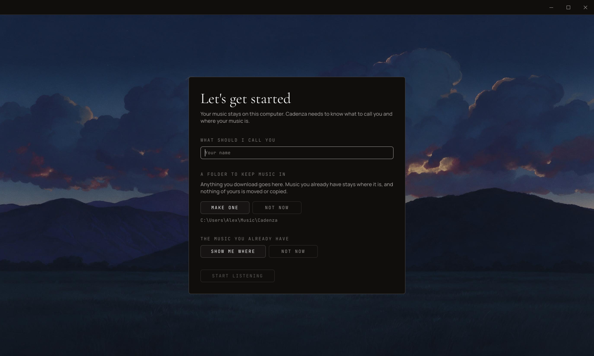
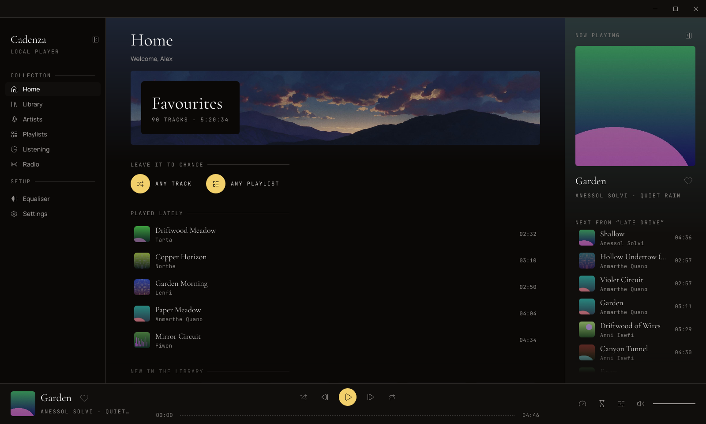
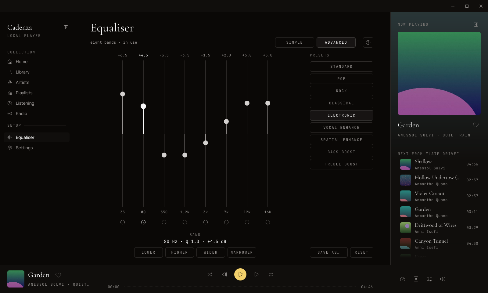
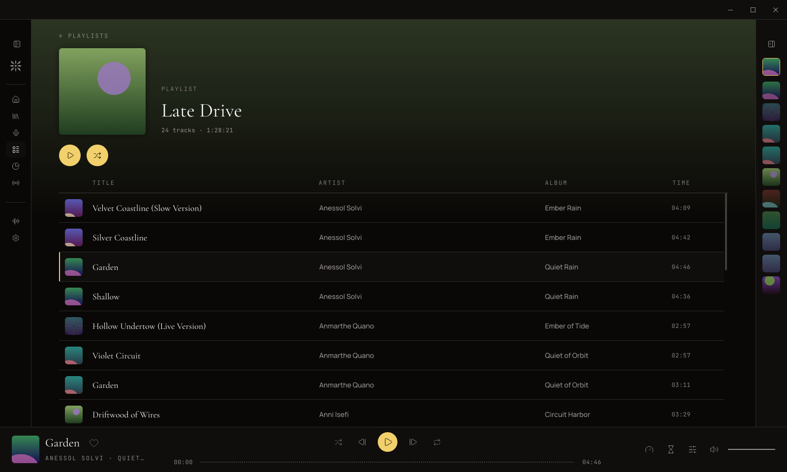
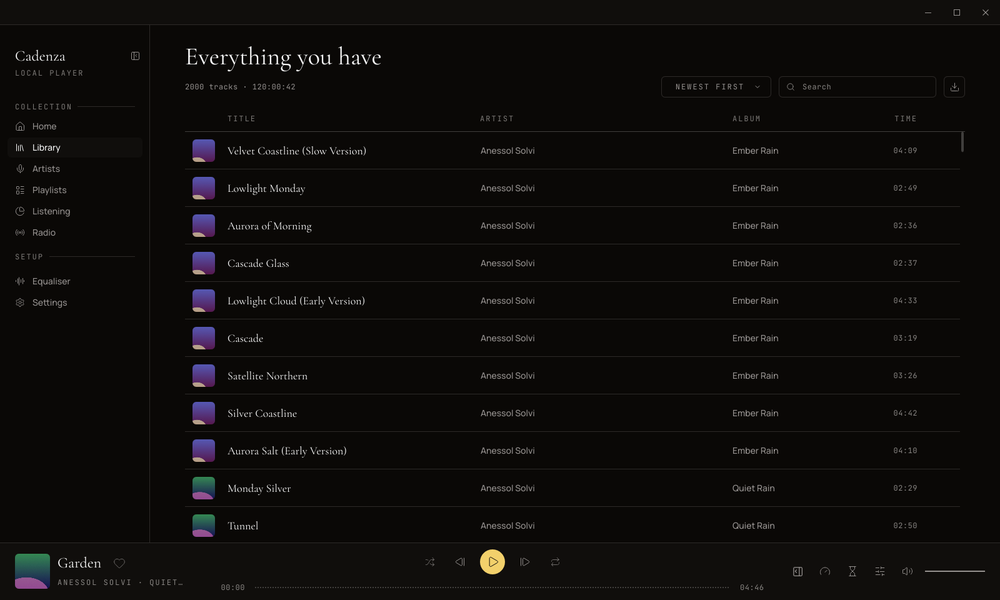

# Cadenza

A local music player for Windows: your music is files on your disk, and
nothing here depends on a service being up. No account, no cloud, no
telemetry, no neural networks, and no network client of its own - close the
connection and everything still works.



- Library built from folders you point it at, kept current while the window is
  open: files copied in are noticed, files removed are noticed
- MP3, AAC, ALAC, FLAC and WAV
- Playlists with covers of their own, and a page for each artist in the library
- A queue: the button on a row puts a track in it, and its rows can be carried
  into another order
- Shuffle that listens to what fits, and a radio built from your own library
- Crossfade and gapless playback
- An equaliser that remembers each track's sound - three knobs, or eight
  parametric bands
- What you listened to, kept for thirty days - or not kept at all, if you say so
- Playlists read in from and written out to `.m3u8`, so they travel to and from
  other players
- A copy of everything in one file, and everything put back from it
- Both side columns fold away, as far as you like
- Dark and light, four sizes, English and Russian
- Paste a link and the track joins the library - one track, or a whole playlist

## What you need

Windows 10 or 11, 64-bit.

## Installing it

Take the `.msi` from
[Releases](https://github.com/RimaksX/Cadenza/releases) and run it. It installs
for the current user only and never asks for administrator, and a later version
replaces this one rather than standing beside it.

The installer is not signed, so Windows shows a SmartScreen warning before it
will run it: choose **More info**, then **Run anyway**.

## The first run

Cadenza asks what to call you and where your music is. Point it at the folder
you keep it in - or let it make one - and the library builds itself from what
is there. More folders can be added in Settings at any time.



Home is where it starts after that: your favourites, a track or a list left to
chance, and what you played lately.



The pictures here show a library made up for them - the artists, titles and
covers are invented.

## A sound for each track

One curve for everything suits almost nothing. Choose a preset while a track
plays, or shape the sound yourself, and that track keeps it: the next time it
comes round it sounds the way you left it. A track you never touched starts
from Standard.

Three knobs - bass, middle, treble - for a quick change, or eight parametric
bands, each with its own frequency, width and gain, for a precise one. Nine
presets come with it, and a sound you like can be saved under a name of your
own.



## Laid out your way

The destinations down the left and the panel of what is playing on the right
both fold away. Folded, the left keeps its icons and the right a strip of what
is coming next; or, if you would rather have the whole width, the right one
goes altogether and a button in the player bar brings it back. Cadenza
remembers how you left it.

<p>
  
  
</p>

## A copy of everything

**SAVE A COPY** in Settings writes one `.cadenza` file: playlists, history,
sounds and the pictures you chose. Your music is not in it - that stays where it
is - so the copy is small enough to keep anywhere.

**RESTORE** puts a copy back in place of everything. Cadenza closes, and the
next time it opens it is on the copy; what was there before is kept beside it
rather than thrown away.

## Bringing a track in from a link

The download button at the top of the library opens a field that takes a web
address. **ADD TRACK** brings down one track; **ADD PLAYLIST** brings down a
whole list and makes a playlist of it. Pressing **STOP** keeps what has already
landed.

Cadenza downloads nothing itself. It runs **yt-dlp** to fetch, **ffmpeg** to
turn what arrives into an mp3, and **spotDL** to read what a Spotify link names.
It offers to install any of them the first time a link needs one, and to update
yt-dlp when a site has moved on; nothing is installed without that press.

Download only what you have the right to.

<details>
<summary>Why those programs are not inside Cadenza, and what a Spotify link does</summary>

They are kept current by the people who watch the sites they fetch from, so
the feature does not quietly stop working between releases here. yt-dlp and
ffmpeg come from winget, and so does Python, when a Spotify link needs it on a
machine that has never had one; spotDL comes from Python's own pip, which is
the only place it exists. No restart is needed after an install.

Nothing takes audio out of Spotify - its streams are encrypted, and every tool
that claims otherwise does what this does. The link is read for the titles,
artists and albums it names, and each of those recordings is then found and
downloaded from YouTube. Apple Music, Tidal and Deezer are refused rather than
attempted: their audio is encrypted too, and there is nothing at those
addresses to read names from.

</details>

## Where your things are

The library database and the settings follow your Windows profile:

```
%APPDATA%\Cadenza
```

The cover art it has cached, its log, and its record of what it has already
fetched stay on the machine, because they are large and can be made again:

```
%LOCALAPPDATA%\Cadenza
```

Downloaded tracks go to a folder of their own - `Music\Cadenza` under your user
folder - and the music you already had is never moved, copied or written to.
Cadenza reads your folders and remembers where things are; it does not tidy
them.

## Building it yourself

You need [Rust](https://rustup.rs) 1.92 or later and the Visual Studio Build
Tools with the C++ workload, which the Windows Rust toolchain links with:

```
cargo build --release
```

The player is then `target/release/cadenza.exe`. It is self-contained: the
fonts and the icons are inside it.

## Licence

GPL-3.0-only. The interface is built on [Slint](https://slint.dev), used here
under GPLv3, so that is the licence the whole work can be offered under. The
full text is in [LICENSE](LICENSE).
